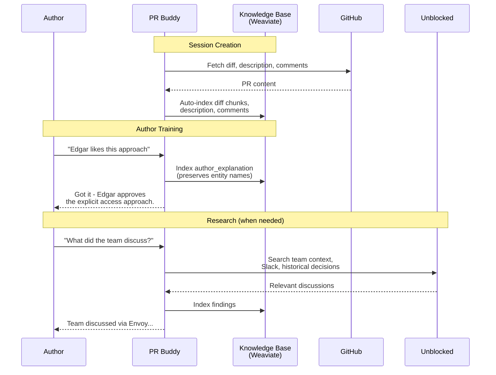
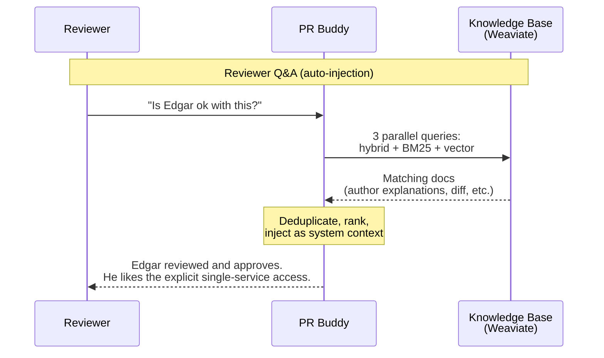
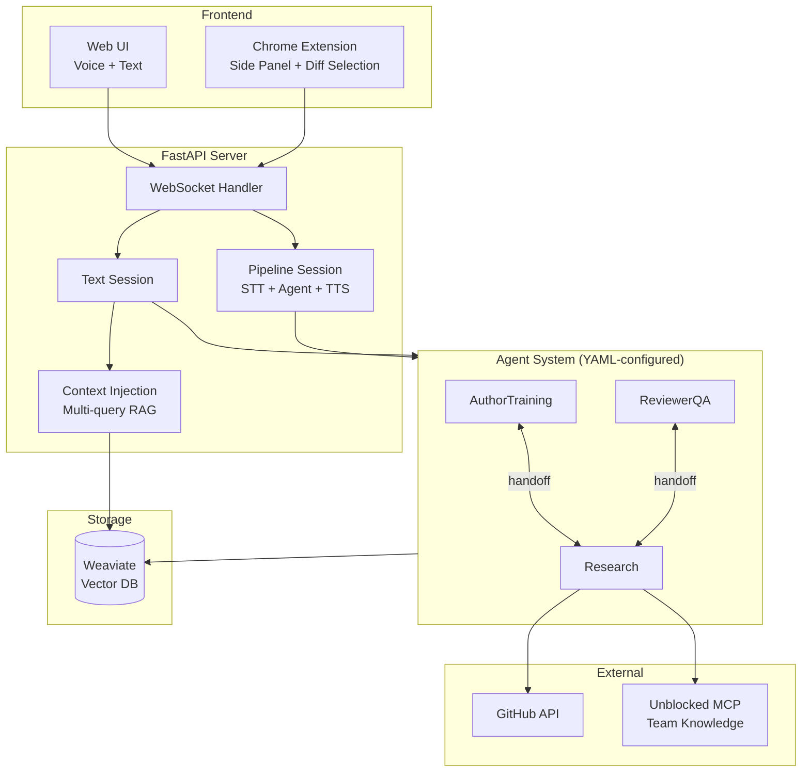

# PR Buddy

An AI-powered review companion for pull requests. Authors train agents with context about their PR, and reviewers can then ask questions — getting answers grounded in author knowledge, code diffs, and team context.

## How It Works





## Architecture



## Key Features

- **Auto-indexed PR context** — Diff, description, and comments are fetched from GitHub and indexed into Weaviate on session creation. Agents start with full context immediately.
- **Auto-context injection** — Before each reviewer question, 3 parallel RAG queries (hybrid, BM25, vector) surface relevant author knowledge automatically. The agent doesn't need to decide to search.
- **Entity-aware indexing** — Author explanations preserve people, team, and system names for reliable keyword matching (e.g., "Edgar" stays "Edgar", not "a stakeholder").
- **Voice + Text modes** — Text chat or voice (Whisper STT + Polly/OpenAI TTS).
- **Diff selection** — Chrome extension lets reviewers highlight code and ask questions with that context.
- **Research via Unblocked MCP** — Agents can search Slack, Jira, historical PRs, and team discussions.

## Quick Start

```bash
# Setup
make setup

# Edit .env and add your OPENAI_API_KEY

# Start Weaviate + dev server
make dev
```

Then open http://localhost:8000 in your browser.

### Chrome Extension

Load the extension for the side panel experience on GitHub PRs:

1. Go to `chrome://extensions`
2. Enable **Developer mode**
3. Click **Load unpacked** and select the `prbuddy-extension/` directory

### Voice Mode Requirements

For voice modes (Pipeline), you need:
- **ffmpeg** — `brew install ffmpeg` (macOS) or `sudo apt install ffmpeg` (Linux)
- **OPENAI_API_KEY** — For Whisper STT
- **AWS credentials** or **ELEVENLABS_API_KEY** — For TTS

## Session Modes

| Mode | Description | Latency |
|------|-------------|---------|
| **Text** | Chat-based Q&A | Instant |
| **Pipeline** | Whisper STT + Agent + TTS | ~2-3s |

## Configuration

Agent behaviors are configured via YAML files in `config/agents/`:

| Directory | Agents | Purpose |
|-----------|--------|---------|
| `common/` | Research | Context gathering from GitHub + Unblocked |
| `author/` | AuthorTraining, AuthorEngagement | Author interview and knowledge capture |
| `reviewer/` | ReviewerQA | Reviewer Q&A with citations |

## Development

```bash
make setup    # Install dependencies
make dev      # Start Weaviate + server (hot reload)
make test     # Run unit tests (81 tests)
make eval     # Run evals (requires Weaviate + OPENAI_API_KEY)
make clean    # Clean up generated files
```

## Evals

The `evals/` directory contains end-to-end scenarios that verify author-to-reviewer knowledge sharing:

| Scenario | Tests |
|----------|-------|
| `edgar_approval` | Author says "Edgar likes this" — reviewer can find it with 5 phrasings |
| `technical_decision` | Author explains tradeoff — reviewer finds the reasoning |
| `indirect_reference` | Author provides context — reviewer finds it with different wording |

```bash
make eval  # Requires Weaviate running + OPENAI_API_KEY
```

## License

MIT
